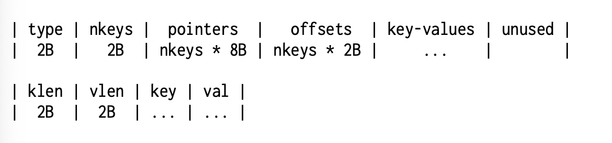

# database-go
### Working on a database implementation from scratch in Go
Inspired by James Smith's *Building...*

## Deciding on a Data Structure

### Hashtables
This might seem like a good idea, but it is only viable if you consider only **point queries** (get, set, del)

#### Challenges

- How do we grow the table? Moving things inevitably will cause an $O(N)$ process
- In-place updates will be less viable
- space reuse is a possible problem

### Sorted Arrays
Binary search is $O(\log N)$, but updating it will be $O(N)$. Not practical

### B-Tree (B+Tree Variant)
Viable.

### LSM-tree
Viable

## B+Tree Implementation

Consider 3 things to maintain:
1. Same heigh for all leaf nodes
2. Node size is bounded by a constant
3. Node is not empty.

### Implementation on Disk (Important Considerations)

Things change when you are dealing with real hardware, something I had not encountered before (at a DB level)

B-Tree implementations have more important considerations when you start worrying about disk and memory.

#### Block-Based allocation

How does one limit node size? There isn't any garbage collectors or *malloc*, so space allocation and reuse is on us.

Can use something called a *free list*, but that is if allocations are of the same size.

#### Safe Updates

Three crash resistant concepts when updating disk data:
1. You rename files (create a temp, work on that, replace original)
2. You maintain logs
3. You use LSM-trees structure, which are based on logging

For the **B-tree** implementaiton, we can make a copy of the node, and modify the copy instead.

This applies to Insertion and Deletion operations.

This is something called *copy-on-write* data structure
- It is immutable
- It is append-only
- It is persistent, but not the verb related to *durability*

Two problems with this approach:
1. How to find tree root as it changes after each update? solve this later
2. How do we resuse nodes from old versions? *free list* helps here

### Node Structure

Constant idx values to move ahead helps KV lookups reduce to O(1). Very neat. However, how would they scale?

## TODO List

- nodeLookupLessEqual
    - Implement binary search
    - Why not just break when $found = i$?

- nodeInsert
- leafUpdate
- nodeSplit2
- SetPtr
- SetOffset